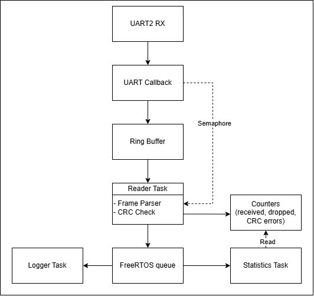

# ESP32 FreeRTOS Embedded Frame Parser & Data Logger

Real-time ESP32 firmware implementing a FreeRTOS-based UART frame processing pipeline. 

Incoming bytes are captured through a UART receive callback, buffered using a single-producer/single-consumer ring buffer, parsed using a state machine, validated with CRC-8, and passed between tasks using FreeRTOS queues and semaphores.

---

## Key Features

- UART receive handling using ESP32 UART2
- Interrupt/callback-driven byte reception
- Single-producer/single-consumer ring buffer
- State-machine based frame parser
- CRC frame validation
- FreeRTOS task-based architecture
- FreeRTOS queues and synchronization primitives
- Frame statistics and error/overrun tracking
- Unit tests for ring buffer, CRC, and frame parsing

## Architecture overview

---

## Protocol

CAN inspired frame structure:

| SOF | ID | DLC | DATA | CRC |
| --- | --- | --- | ---| --- |
| 0xAA | 2 bytes | 1 byte | 0-8 bytes | 1 byte |

What each field responsible for:

| Field | Size | Description |
| --- | --- | --- |
| SOF | 1 byte | Marks start of each frame |
| --- | --- | --- |
| ID | 2 bytes | Frame identifier |
| --- | --- | --- |
| DLC | 1 byte | Number of data bytes |
| --- | --- | --- |
| DATA | 0 to 8 bytes | Payload |
| --- | --- | --- |
| CRC | 1 byte | CRC-8 checksum |

## Hardware

For this project was used microcontroller ESP32, it's GPIO 16 and 17 were connected to each other to provide UART TX/RX loopback on the board.

---

## How to build and flash

---

## Performance results

| Interval | Frames/sec | Received | Dropped |
|---|---|---|---|
| 500ms | ~2 | All | 0 |
| 10ms | ~100 | All | 0 |
| 1ms | ~1000 | ~5/s | ~500/s |

---

## Debugging

ESP32 Arduino's Serial2.onReceive() isn't a true hardware ISR, but a software callback

Initial implementation read only one byte per callback causing hardware buffer to fill up, which caused it to stop working after a few frames

**Fix**: draining all available bytes inside the callback clears the hardware buffer completely, preventing stalls

*P.S. On direct UART interrupt registers (Like STM32 board has) this issue doesn't exist - the ISR fires per byte at the hardware level*

---

## What I learned

During my work on this projects I learned what CAN bus consists of and how to build code for one 

Before I only knew theory, now I'm capable of building one myself :)

I learned how to structure firmware around independent tasks that communicates through structures like semaphores and queues, rather than using single loop for everything

Also this was my first time working on interrupts - my previous projects didn't require them. I encountered issue with my original implementation, came up with temporary solution and after some debugging, fixed ISR and came back to original, cleaner implementation
